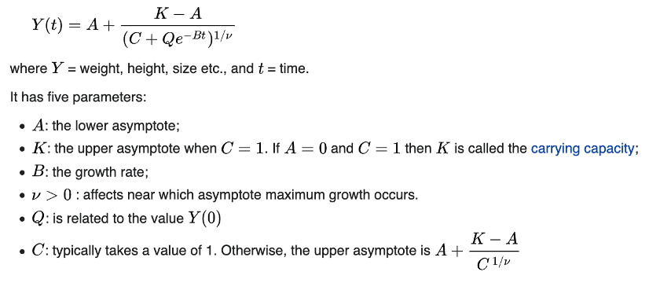
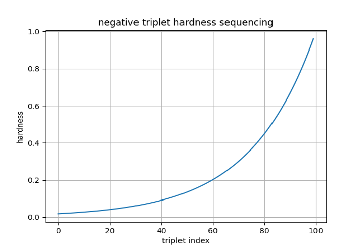
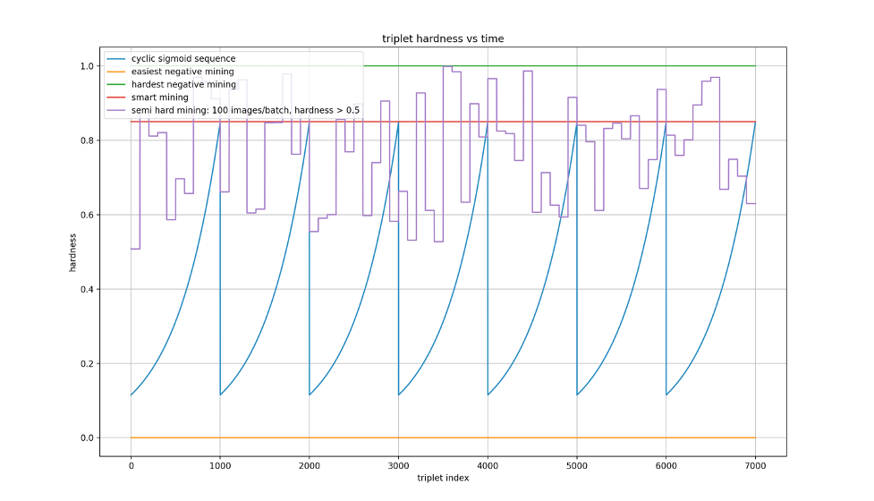

# Sigmoid-Triplet-Sequencer
 Sigmoid triplet hardness sequencing  for triplet loss
 
# Why? 
------------------

## 1. MODEL COLLAPSE

The Triplet loss and other similarity-based approaches including Siamese twin networks and Generative models suffer from two major issues in general. This is being researched heavily and there are various handling strategies are shared in the community [7]

The overfitting nature of similarity-based model also gives rise to another major issue known as
model collapse. When a model does not find a proper gradient for long, it starts generating same
embeddings for all. Simply speaking the features fall to 1, this means that the loss falls down to
margin value, this is how model collapse is detected.

## 2. Proposed Sigmoid triplet hardness sequencing approach

A triplet network needs to start off with easy triplets in order to not take too much of a loss from
the start and eventually collapse, hence semi-hard approach is preferred over hardest negative
mining. However semi-hard triplets are not informative in terms of being limited in by the batch
size, hence the model does not learn much. In order to control this smart mining[9] approach was
introduced which controlled the hardness.

However, non-linearity and exposure to the whole dataset in a random order can also be realized
by below means,

* Variation in hardness which is very essential for the model to actually explore the loss plot.
* Introducing the model to each class as a reference at-least once, which doesn’t happen in
huge datasets due to random selection of triplet references.

Extending the use of the control parameter introduced in smart mining technique described above,
we propose a new variable hardness sequencing approach. In this approach we do a random
sampling in the with number of classes to find randomly distributed indices with just one instance
of each class. We keep repeating the process and add the resulting list to a master list of size
defined by the total training triplets till no more of these lists can be accommodated, the rest of the
master list is filled with another random sampling of remaining master list size.

Apart from having the capability to sequence the selection of reference/anchor images, this
approach also lets us address both the need to start off the training with easy triplets and also
eventually using the full potential of the offline mining in terms of hardness. This way we create 
a sequence of triplets to be fed to the model without shuffling, so that the hardness of the triplets
varies with respect to time in a continuous manner. This variation can be done in any way needed,
the most appropriate options for gradual hardness increase would be one of the below curves,

* Linear
* Sine
* TanH
* Logarithmic
* Sigmoid

The linear increase was the simplest to implement and increased the hardness gradually but using
a non-linear function like sine curve or a sigmoid curve, the model is forced to explore the loss
plot and train with a non-linearly varying hardness over time. In light of triplet network specific
requirements, the best fit for this would be a general logistic sigmoid function,


Source: https://en.wikipedia.org/wiki/Generalised_logistic_function

The slope for the logistic sigmoid function was adjusted using the growth rate and the carrying
capacity is set to the threshold control parameter provided by user. A sample sequence is given
below,


Figure 1 : Hardness sigmoid sequencing ( scaled down by 10 )

The above plot is a sigmoid hardness sequence on a dataset of 10,000 images. The hardness
threshold was set to 0.7, the growth rate was set to 3 to provide a lenient training difficulty. The
model collapse issue was successfully nullified after introducing the non-linearity which was
verified by a natural decrease of loss value instead of converging to margin value. Also, a 30%
accuracy bump from hardest negative mining method was seen. However, the evaluation was
performed with only 10 epochs so a chance of delayed collapse or overfitting might occur for huge
datasets.

Also in case of huge datasets, like the client dataset we are working on has ~35,000 classes and 1-
2 image per class, so in order to introduce the model to a sequence with a coverage of 2 times per
class, 70,000 triplets are needed to be sequenced. However our hardness sigmoid function will act
like an easiest negative miner for a huge number of batches. This means the model will
ineffectively learn with the minimum difficulty of triplets and collapse before the gradual hardness
growth takes effect. So for huge datasets we provide the sequence with a cyclic sigmoid input
defined by a number of cycles, so that each cycle roughly mimics the hardness distribution full
cycle for the baseline model. For 70,000 triplets we set the number of cycles accordingly to 70,
amounting to 1000 triplets per cycle to be found from the whole dataset with the defined hardness
distribution sequence. The visual comparison plot between the different mining methods and the
respective hardness distribution over one epoch, is given below,


Figure 2 : Triplet mining methods and the respective hardness with respect to time through 7000 triplets

The different triplet mining methods were compared on a dataset of 70,000 triplets mined from the
sample client dataset with 1 or 2 images per class testing against two of the original limitations
regarding the low image to class ratio and model collapse issue. The results for the proposed
Sigmoid hardness sequencing method, still show signs of overfitting and catastrophic forgetting
[3] and can be further tuned to overcome the same. However, the steady decrease in loss and an
accuracy bump of 30% show that the sigmoid triplet hardness sequencing approach proposed
herein was seen to overcome the model collapse issue, despite the low-class variance limitation. 

## 3. Evaluation Results: 

Dataset: 70,000 triplets – 70,000 images – 35,000 jewelry products (1:2 class to sample ratio)


The performance comparison results of different mining strategy along with our proposed
strategy are given below,

| Mining strategy | Training accuracy | Top50 validation accuracy | Model collapse |
| --- | --- | --- | --- |
| Easiest negative mining | 0.45 | 0.11 | yes |
| Hardest negative mining | 0.61 | 0.17 | yes |
| Sigmoid hardness sequencing | 0.90 | 0.47 | no |
| Cyclic sigmoid hardness sequencing | 0.92 | 0.44 | no |

Table 1 : Mining approach comparison with offline mining – 10 epochs on 1,000 triplets with 1 image per class

The steady decrease in loss show that the sigmoid triplet hardness sequencing approach
proposed herein was seen to overcome the model collapse issue, despite the low-class variance
limitation. The results for the proposed Sigmoid hardness sequencing method, still show signs
of overfitting and catastrophic forgetting and can be further tuned to overcome the same.

 
## 4. Usage:
------------------
```
input = Input(shape=(HEIGHT, WIDTH, CHANNELS))
image_model = tf.keras.applications.InceptionV3(include_top=False,
                                                    weights='imagenet')
encoder = Model(inputs=input, outputs=image_model.outputs, name="encoder")


#set params

data_filename = 'train.csv'
catalog_filename = 'reference_catalog_images'           # tweak get_triplet function above for no catalog support
train_test_split_ratio = 0.2
ycolname = 'class'
xcolname = 'file'

#optional sigmoid curve params

total_data_points = 700000      # total number of triplets -- default 10000
hardness_threshold = 0.8        # maximum hardness (between 0-1) -- default 0.85
num_hardness_cycles = 70        # number of sigmoid cycles (should be >=1) -- default 10


#get filename lists

train_ref, train_pos, train_neg, test_ref, test_pos, test_neg = create_data(data_filename, catalog_filename, train_test_split_ratio, ycolname, xcolname, total_data_points=total_data_points, hardness_threshold=hardness_threshold, num_hardness_cycles=num_hardness_cycles)
```

Code References
------------------

* Tensorflow Documentation 
https://www.tensorflow.org/api_docs
* Keras Documentation
https://keras.io/api/
* Github - Gombru – ranking Loss
https://gombru.github.io/2019/04/03/ranking_loss/
* Towards Data Science - Image similarity using Triplet Loss - Shibsankar Das
https://towardsdatascience.com/image-similarity-using-triplet-loss-3744c0f67973
* Github – adambielski – Siamese-triplet
https://github.com/adambielski/siamese-triplet


Bibliography
-------------------

1. Eakins, J., and Graham, M. 1999. Content-based image retrieval.
2. Cao, B., Araujo, A., and Sim, J. 2020. Unifying deep local and global features for image search. In European Conference on Computer Vision (pp. 726–743).
3. French, R. 1999. Catastrophic forgetting in connectionist networks. Trends in cognitive sciences, 3(4), p.128–135.
4. Koch, G., Zemel, R., and Salakhutdinov, R. 2015. Siamese neural networks for one-shot image recognition. In ICML deep learning workshop.
5. Hoffer, E., and Ailon, N. 2015. Deep metric learning using triplet network. In International workshop on similarity-based pattern recognition (pp. 84–92).
6. Xuan, H., Stylianou, A., and Pless, R. 2020. Improved embeddings with easy positive triplet mining. In Proceedings of the IEEE/CVF Winter Conference on Applications of Computer Vision (pp. 2474–2482).
7. Hermans, A., Beyer, L., and Leibe, B. 2017. In defense of the triplet loss for person reidentification. arXiv preprint arXiv:1703.07737.
8. Smith, L. 2017. Cyclical learning rates for training neural networks. In 2017 IEEE winter conference on applications of computer vision (WACV) (pp. 464–472).
9. B. G. Vijay Kumar and Ben Harwood and Gustavo Carneiro and Ian D. Reid and Tom Drummond 2017. Smart Mining for Deep Metric Learning. CoRR, abs/1704.01285.


PS. I am a poor student, If you find it useful consider giving me a shoutback, mention or like please :)
